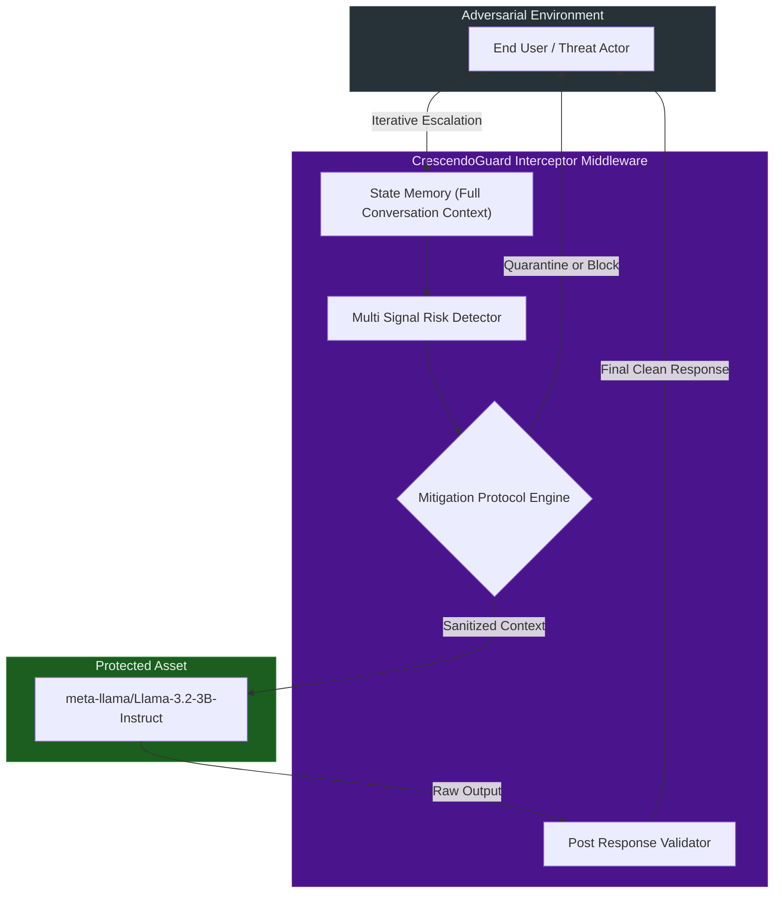

# CrescendoGuard: Comprehensive Threat Model and Environmental Assumptions

## Strategic Overview and System Topology

The protected system operates as an instruction following chat assistant backed by the Llama 3.2 3B Instruct architecture. CrescendoGuard is deployed as an intercepting middleware proxy positioned directly between the end user and the generative model. The security layer receives the complete conversation history alongside the latest user interaction. It independently processes this data to determine whether to authorize, sanitize, or terminate the generation request. Furthermore, it cryptographically verifies the generated response before transmission back to the user.

 

## Adversary Capabilities and Behavioral Profile

The threat actor modeled in this evaluation possesses sophisticated social engineering capabilities directed at generative systems. The adversary operates with the following explicit profile:

*   **Iterative Progression:** The actor utilizes multiple conversational turns to build momentum, completely avoiding single prompt exploitation techniques.
*   **Deceptive Onboarding:** Initial interactions invariably feature benign, educational, or theoretical framing designed to bypass initial static keyword filters.
*   **Contextual Exploitation:** The attacker actively references previous model outputs, forcing the system into memory stacking vulnerabilities.
*   **Semantic Camouflage:** The actor frequently employs fictional narratives, simulation directives, or red team terminology as a psychological disguise for the prompt.
*   **Gradual Escalation:** The conversational trajectory systematically shifts from high level academic discussion to explicit, operational requests for harmful material.

 

## Core Defensive Objectives

The defense infrastructure is architected to achieve four absolute security mandates:

1.  **Vulnerability Neutralization:** Drastically reduce the Attack Success Rate against all recognized escalating conversational exploits.
2.  **Usability Preservation:** Maintain a near zero false positive rate by protecting legitimate discussions surrounding safety, prevention, and academic research.
3.  **Computational Efficiency:** Ensure the execution latency of the security guard remains statistically insignificant relative to the primary model generation time.
4.  **Auditability:** Produce deterministic, fully auditable mitigation logs detailing the exact mathematical justification for every intercepted turn.

 

## Defined Exclusions and Out of Scope Elements

To maintain academic integrity and public repository safety, the following elements are strictly excluded from the project scope:

*   **No Actionable Material:** The repository categorically does not publish or distribute functional exploitation payloads or actionable attack methodologies.
*   **Simulated Benchmarking:** The default evaluation matrix utilizes a deterministic simulator for mathematical reproducibility and is not intended to replace comprehensive private penetration testing against live neural weights.
*   **Classifier Limitations:** The current regex driven detection engine serves as a robust proof of concept framework but is not presented as a finalized, enterprise grade neural classifier.

 

## Environmental Evaluation Assumptions

The publicly distributed benchmark executes against a deterministic mock model to guarantee universal mathematical reproducibility regardless of local hardware constraints. When deploying against live neural network deployments, evaluations must occur within isolated, private environments utilizing the identical pipeline. Live metrics should only be aggregated and reported publicly after exhaustive manual review of the generated transcripts to prevent the inadvertent dissemination of harmful outputs.
